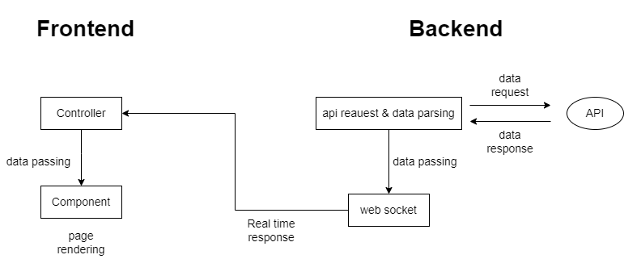

# 0. 프로젝트 목표

- 서버와 클라이언트가 실시간 통신으로 데이터를 주고 받는다.
- 서버는 새로운 데이터가 들어올 때마다 데이터를 parsing하여 클라이언트에 전송한다.
- 클라이언트는 서버가 전송한 데이터를 알맞은 포맷으로 출력한다.

# 1. 기술 스택

## 서버

- `webSocket`으로 실시간 data 통신 구현 

  - 주식, 코로나, 음원 차트 등 실시간으로 데이터가 변하는 api 이용

- node.js로 서버 구축

  - `express.js` 사용

    

## 클라이언트

- React를 이용한 component 개발 및 렌더링

- 모던 CSS 이용

  - `styled component` 라이브러리 사

- `Next.js`를 이용한 SSR로 SEO 대처

  

## 빌드

- `gulp`
- `parcel`

## (배포)

- `AWS` 
  - docker? kubernetes?

# 2. 요구사항

## 서버

- **Real time으로 api 데이터**를 받아온다.

- **Websocket**으로 받아온 api 데이터를 클라이언트에 전송한다.

  

## 클라이언트

- api 항목별로 **button → modal** 을 만든다.

- library나 framework 사용 없이 **store를 구현**한다.

  - **state, actions, mutations, getter, watch**

- **freefrontend**를 참고해서 component를 디자인한다.

  

## data flow

